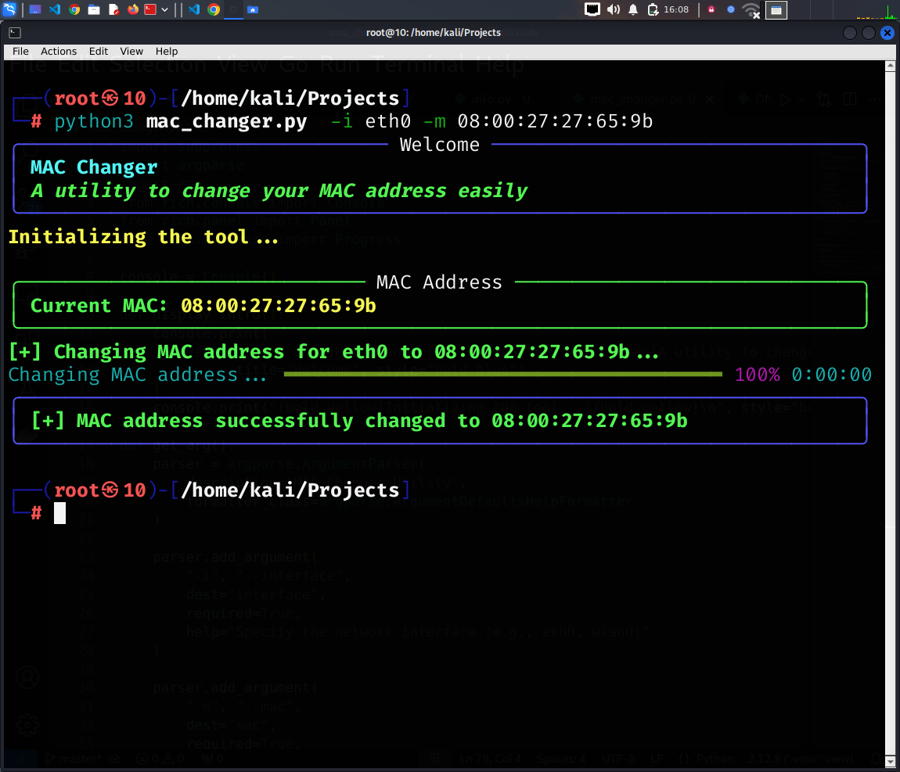

# MAC Changer Tool

<p align="center">
  <a href="#introduction">Introduction</a> •
  <a href="#features">Features</a> •
  <a href="#installation">Installation</a> •
  <a href="#usage">Usage</a> •
  <a href="#working">Working</a> •
  <a href="#future-enhancements">Future Enhancements</a> •
  <a href="#disclaimer">Disclaimer</a>
</p>

---

## Introduction

The **MAC Changer Tool** is a Python-based utility designed to change the MAC address of a specified network interface. 
This tool can help enhance privacy, perform penetration testing, or bypass network restrictions by modifying the device's hardware address.

---

## Screenshots

<h1 align="left">
  </a>
  <br>
</h1>

---

## Features

- **MAC Address Modification**: Change the MAC address of any network interface easily.
- **User-Friendly CLI**: Intuitive command-line interface for seamless interaction.
- **Input Validation**: Ensures the MAC address format is correct (XX:XX:XX:XX:XX:XX).
- **Rich Output**: Uses the `Rich` library for styled and color-coded displays.
- **Progress Tracking**: Displays a progress bar during the MAC change process.
- **Error Handling**: Provides clear error messages for invalid inputs or permissions issues.

---

## Installation

### Prerequisites

To run this tool, you need:

- **Python**: Version 3.6 or higher.
- **Rich Library**: Install it using pip.

### Installation Steps

1. Clone the repository:
   ```bash
   git clone https://github.com/your-repo/mac-changer.git
   cd mac-changer
2. Install dependencies:
   
       pip install rich

---

## Usage


Run the tool with the required arguments:

```bash
python mac_changer.py -i <interface> -m <new_mac_address>
 ```
Replace `<interface>` with your network interface (e.g., `eth0`, `wlan0`) and `<new_mac_address>` with the desired MAC address in the format` XX:XX:XX:XX:XX:XX.`

     python mac_changer.py -i eth0 -m 00:11:22:33:44:55

Press `Ctrl+C` to stop the tool gracefully if needed


---

## Working
1.  Input Validation: Ensures the new MAC address follows the correct format.
2.  Interface Down: Disables the specified network interface to apply changes.
3.  AC Address Update: Modifies the MAC address using system commands.
4.  Interface Up: Re-enables the interface after updating the MAC address.
5.  Verification: Confirms if the MAC address has been successfully updated.


## Future Enhancements
- Add support for generating random MAC addresses.
- Include an option to restore the original MAC address.
- Implement logging to keep track of changes.
- Develop a GUI-based version for non-command-line users.
- Enhance compatibility with Windows and macOS.

---
## Disclaimer
This tool is intended for educational purposes only. Changing your MAC address on networks without proper authorization is illegal. Ensure compliance with local laws and only use this tool on networks you own or have permission to test. Use responsibly.
